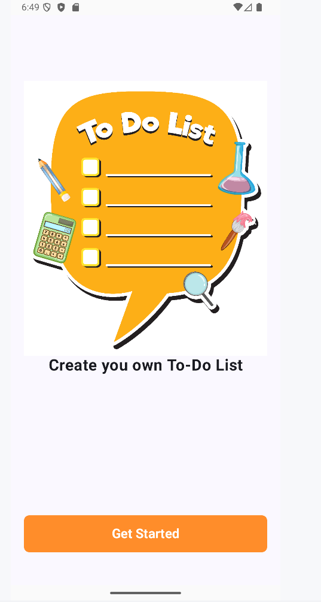
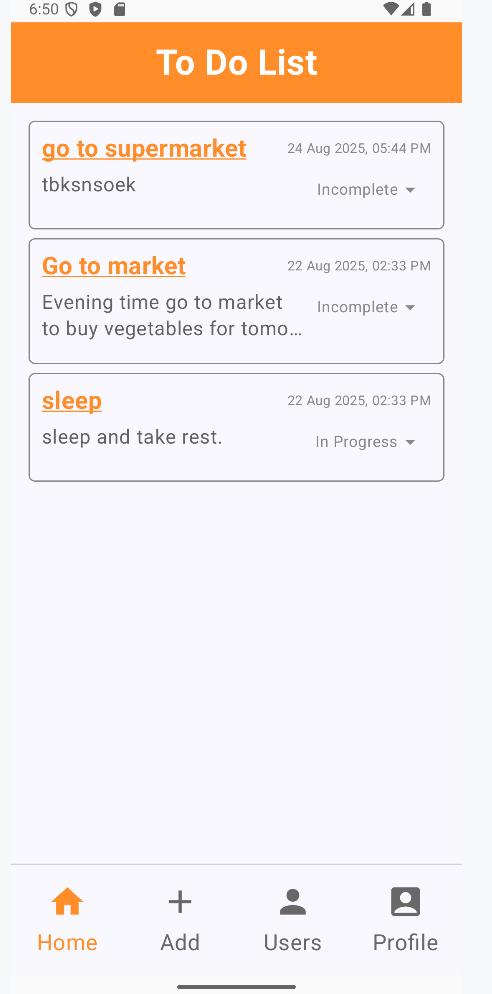
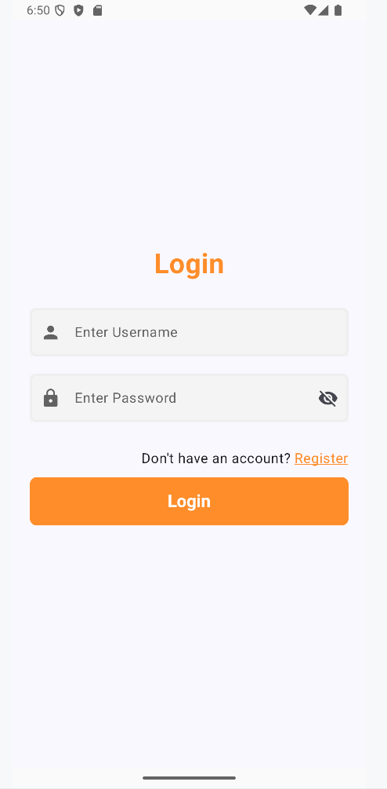
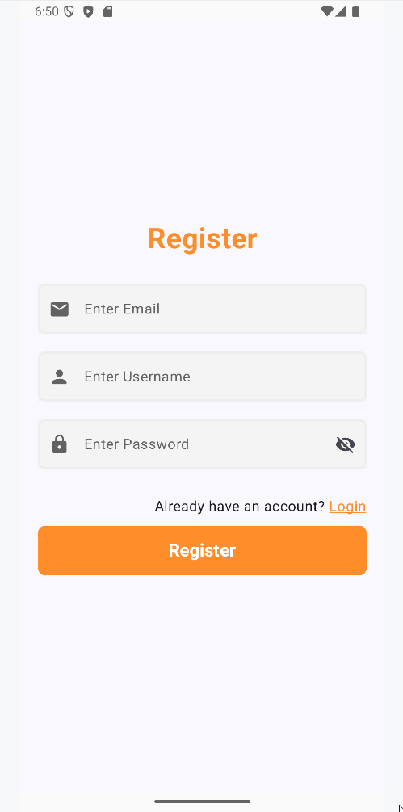
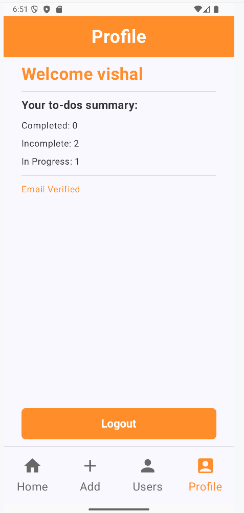
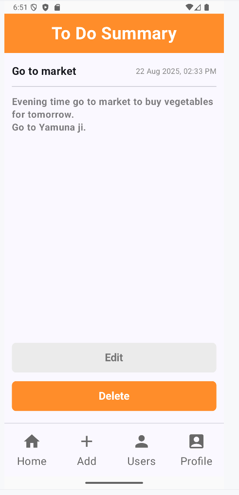
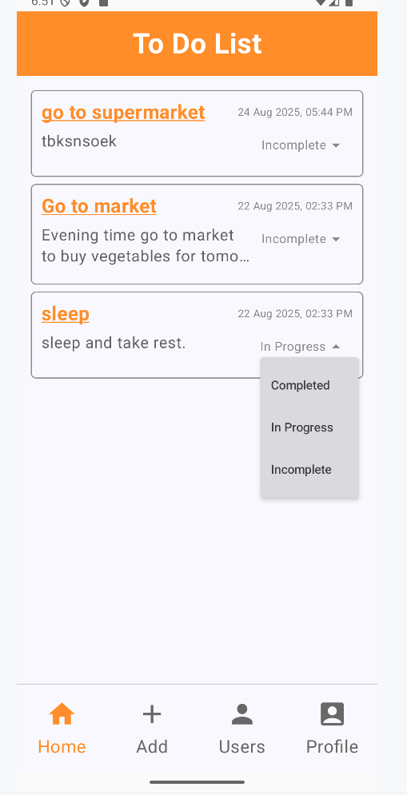

# Mobile ToDo
This is a **Mobile ToDo App** designed to help users manage their daily tasks efficiently.

## Table of Contents

 - [Features](#features)
 - [Tech Stack](#tech-stack)
 - [Screenshots & Demo](#screenshots--demo)
 - [Installation](#installation)
 - [Contact](#contact)

## Features
- User **Registration** and **Login** with secure authentication.
- **Add**, **Edit**, and **Delete** tasks easily.
- Mark tasks as **Completed** or **Pending**.
- **Persistent storage** for user data and tasks.
- **Error handling** and validation for inputs.
- **Logout** with proper **messaging system**.

## Tech Stack

**Language & Framework:**
- Kotlin
- Jetpack Compose

**Architecture & Design:**
- MVVM (Model-View-ViewModel)
- Repository Pattern

**Libraries & Tools:**
- Hilt (Dependency Injection)
- Navigation Component
- ViewModel & StateFlow
- Coroutines & ViewModel Scope

**Backend & Services:**
- Firebase Authentication
- Firebase Firestore (Database)

## Screenshots & Demo

### Screenshots








### Demo
Demo video coming soon.

## Installation

1. **Clone the repository**

Open terminal and run below code.  

```git
git clone https://github.com/Vishal-8630/mobile-todo.git
cd mobile-todo
```

2. **Open in Android Studio**

- Open the project in Android Studio.
- Go to [Firebase Console](https://console.firebase.google.com/)
- Create a new project and add an Android app.
- Download the *google-services.json* file.
- Place it in the *app/* directory.

3. **Build & Run**

- Click **Run** in Android Studio or press *Shift + F10*.
- Make sure **Kotlin, Compose, and required SDK versions** are installed.
- Sync Gradle if prompted.

## Contact

**Author:** Vishal Chaudhary  
**Email:** [vishh8630@gmail.com](mailto:vishh8630@gmail.com)  
**GitHub:** [https://github.com/Vishal-8630](https://github.com/Vishal-8630)  
**LinkedIn:** [https://www.linkedin.com/in/vishal8630](https://www.linkedin.com/in/vishal8630)  
